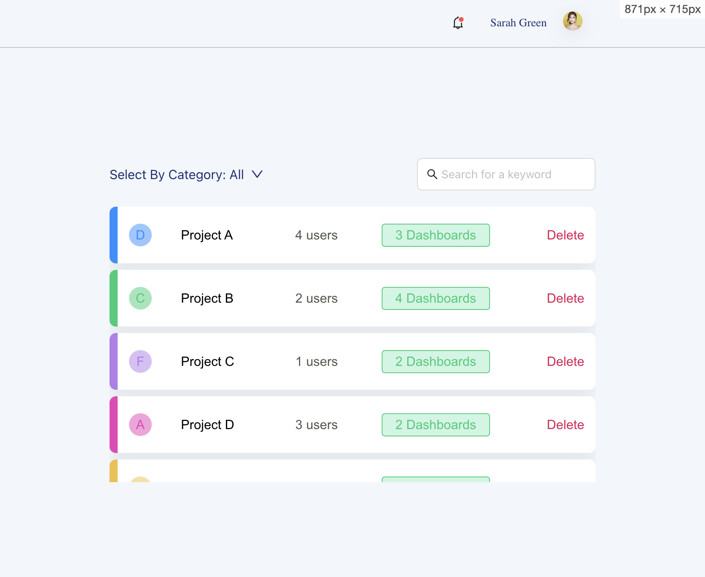

# project-dashboard
Demo for project-dashboard by Qindo

## Installation

Before running the project, you need to install the necessary dependencies.

Using npm:

```bash
npm install
```

## Running the Project
Once the dependencies are installed, you can run the project. 
```bash
npm start
```
This command will start the development server, usually at http://localhost:3000.

## Main Features
 Feature 1:
 Able to view multiple projects with details in the App.
 

 Feature 2:
 Able to select projects by catogory in the App.

 a. Select All
 
 b. select by a single category
 

Feature 3:
 Able to search by project names under different category(case-insensitive)
  

Feature 4:
 Able to delete, and confirm when deleting a project.
  
  result:
  
Feature 5:
Able to adjust layout according to window size. Adapt for mobile(window size less than 860px)


  ## Tech Stack
  The main technologies or frameworks used in the project, such as:
  a. React
  b. AntD
  c. TypeScript
